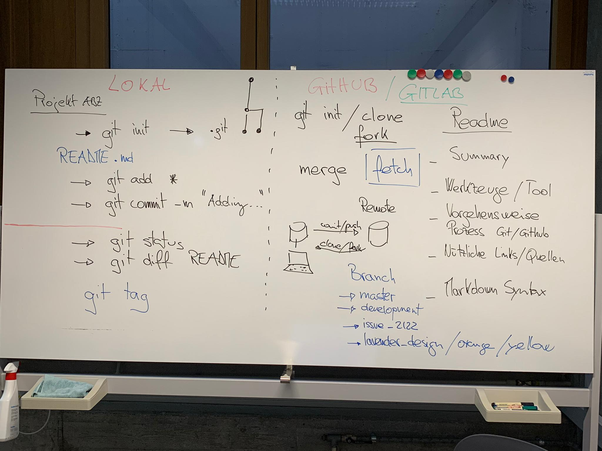

# Mediamatiker Modul 286

## Aufgabe: Client installieren

**Brauche ich eigentlich den GitHub-Desktop-Client, um mit GitHub zu arbeiten?**

Mit GitHub kann man auf verschiedenen Wegen arbeiten. 
Über die Kommandozeile nimmt man das Programm git, das bei macOS und Linux meist vorinstalliert ist;
Windows-Nutzer finden den Download weiter unten. Der Desktop-Client erleichtert das Klonen, 
Committen und Pushen von Repositories in einer grafischen Oberfläche. 
Wer ausser GitHub noch andere Git-Hoster nutzt, dem empfehlen wir einen Blick auf grafische 
Git-Clients wie Tower, GitKraken und SourceTree. Aus vielen Programmierumgebungen kann man per 
Erweiterung auch direkt einen Commit in Git-Projekten erzeugen.

## Summary:

### Git Lokal: 

 - git init --> Erstellt neues repository
 - git add --> Fügt Files hinzu
 - git commit -m "changes on the readme" --> Änderung bestätigen und Nachricht dazu schreiben 
 - git status --> liefert Informationen über die Datein der eigenen Arbeitskopie
 - git diff --> Aktuellen Dateiinhalt mit dem Stand des letzten Commits vergleichen
 
 ### GitHub:
 
 - git init --> Erstellt neues repository
 - clone --> repository clonen (= kopieren)
 - fork --> Abzweigung des ursprünglichen repositorys
 - pull request --> eigene Version vom repository zum Antrag stellen
 - merge --> Eigene bearbeitete Version zum orginalen repository hinzufügen
 - sync --> Synchronisation zwischen Lokaler Datenbank und Remote Datenbank
 

## Werkzeuge / Tool: 

* [**Git for Windows**](https://git-scm.com/download/win) / [**Git for Mac**](https://git-scm.com/download/mac)
* [**Tortoise Git: The Power of Git – in a Windows Shell**](https://tortoisegit.org/)
* [**GitHub Desktop**](https://desktop.github.com/)
* Alle Tools als Übersicht  https://git-scm.com/book/de/v2

## Vorgehensweise / Prozess

## Nützliche Links und Quellen
Was ist github: https://t3n.de/news/eigentlich-github-472886/
Was ist github:https://kinsta.com/de/wissensdatenbank/was-ist-github/
Repository anlegen und code hochladen:https://legacy.thomas-leister.de/github-fuer-anfaenger-repository-anlegen-und-code-hochladen/

* [Unterschied zwischen Github, Gitlab (englisch)](https://usersnap.com/blog/gitlab-github/)

## Markdown Syntax

